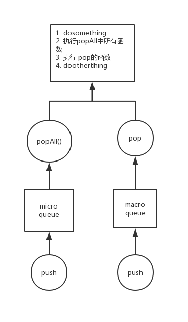

## 事件循环

eventloop 简化模型.



### 1. 任务队列

出列与入列.

```
function Queue() {
    const messages = []
    const popMessage = () => {
        return messages.pop()
    }
    const pushMessage = () => {
        return messages
    }
    return {
        pop: popMessage,
        push: pushMessage
    }
}
const microQueue = new Queue() // 宏任务队列
const macroQueue = new Queue() // 微任务队列
```

### 2. 注册表

注册表提供了其他模块与 js 引擎进行交互的功能,具体实现方式可能是`while(true)`,也可能是观察订阅模式.

```
function Observable(fn, tag = true) {
    const notification = () => {
        if (tag) {
            microQueue.add(fn)
        } else {
            macroQueue.add(fn)
        }
    }
    return {
        notification
    }
}
// registry注册了外部与Observable的关系,外部调用Observable.notification,registry为其他模块与js引擎交互的唯一方式,且能够做记录与进行调试.
const registry = {}
```

### 3. js 运行

```
// 执行传入的函数
const execute = fn => {
    if (typeof fn === 'function') {
        fn()
        return true
    }
    return false
}

// 执行微任务队列中的所有任务
const executeMicro = () => {
    let task = microQueue.pop()
    let tag = true
    while (tag) {
        tag = task()
        task = microQueue.pop()
    }
}

const processNextTick() {
    dosomething1()

    executeMicro()
    execute(macroQueue.pop())

    dosomething2()
}

// 事件循环
while(true) {
    processNextTick()
}
```
