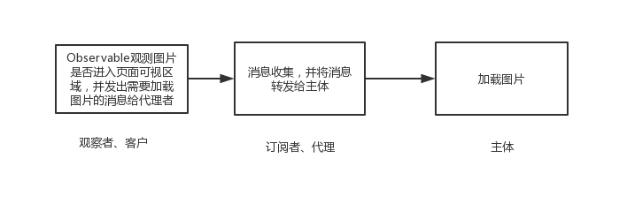

# 图片加载方案(代理模式)

## 1. 流程图



## 2. 为什么使用代理模式

图片加载无论是监听 scroll 事件还是通过 IntersectionObserver 对象，都是发布订阅模式。但除此之外，我们还需要根据某些条件来判断是否执行订阅者的函数。那么所需要的便是如何执行这个用于判断的函数。即`f(x) => f(g(x))`,在这里，`g(x)`可以被替换。这很适合用代理模式。

## 3. 总体框架

```
// 保存某些必要的数据
const container = {
    attr: 'data-img',
    intersection: new IntersectionObserver(fn),
    els: []
}
const client = {
    observeEls: () => {},
    unobserveEls: () => {}
}

const proxy = {
    receive: () => {},
    notice: () => {
        loadImages()
    }
}

const loadImages = () => {}
```

## 3. 客户(发布者)

IntersectionObserver 对象传入一个函数，当监听的元素出现在可视窗口或从可视窗口移出时，触发的回调函数。`isIntersecting`属性为布尔值，`true`表示元素从外部移入可视窗口，`false`表示从可视窗口移出。

```
const intersection = new IntersectionObserver(obs => {
    // 可见元素数组
    const visibleEls = obs.filter(ob => ob.isIntersecting).map(ob => obs.target)
    // 不可见元素数组
    const invisibleEls = obs.filter(ob => !(ob.isIntersecting)).map(ob => obs.target)
    proxy.receive(visibleEls, invisibleEls)
})
```

## 4. 代理

proxy 可以接收客户的信息，并向主体发出加载图片的请求。  
例如:

```
// 如何接收信息
const receive = (visibleEls, invisibleEls) => {
    // 移除从可视窗口移出的元素
    invisibleEls.forEach(el => {
        const index = container.els.indexOf(el)
        if (index > -1) {
            container.els.splice(index, 1)
        }
    })
    // 添加从外部移入可视窗口的元素
    container.els = Array.from(new Set(container.els.concat(visibleEls)))
    proxy.notice()
}

// 如何发送请求,可以通过闭包的方式很轻松地实现节流与防抖
const createNotice = () => {
    return (els) => {
        loadImage(els)
    }
}
```

## 5. 加载图片

```
const loadImages = (els) => {
    els.forEach(el => {
        const url = el.getAttribute(container.attr);
        if (url) {
            el.src = url;
            el.removeAttribute(at);
            container.intersection.unobserve(el)
        }
    })
}
```
